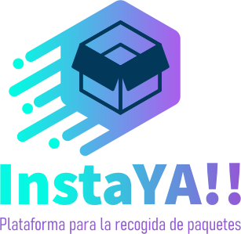
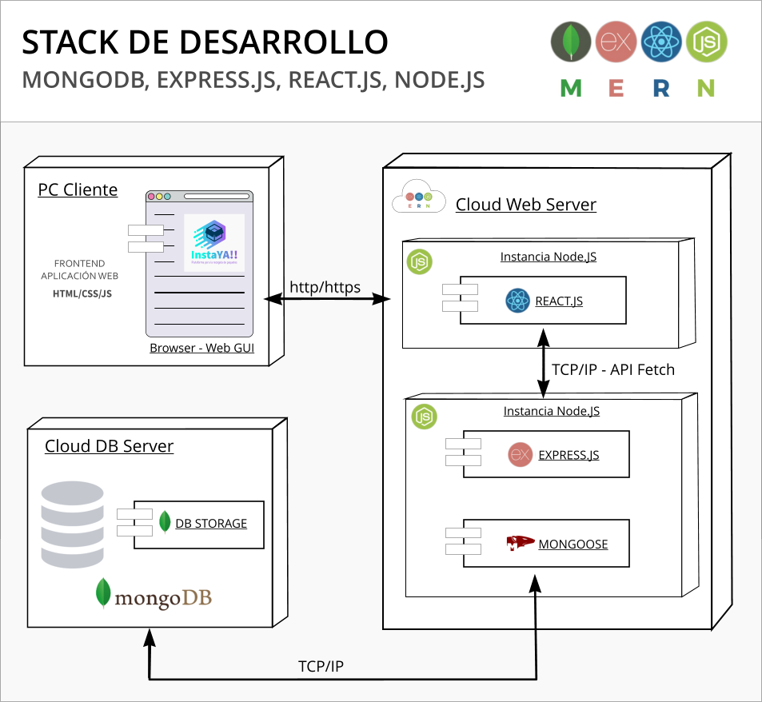

# App-paquetes
## Proyecto de Ciclo IV Mintic 2022

### Proyecto Plataforma Recogida de Paquetes InstaYA!

_Proyecto basado en plantilla Bootstrap_

App-paquetes es una aplicacion básica desarrollada en React utilizando el Stack MERN

Su objetivo es didáctico y funciona como proyecto de evaluación de lo visto en el transcurso del ciclo 4 de Misión TIC Universidad del Norte en el contexto del diplomado __Misión TIC (22) - HABILIDADES EN PROGRAMACIÓN CON ÉNFASIS EN: APLICACIONES WEB // APLICACIONES MÓVILES__ . 

Corresponde a los requerimientos mínimos solicitados para la creación de un sistema de recogida de paquetes

**NRC**: 2240
**Equipo** N° 10
**Integrantes**: 

* *Ezequiel Elguedo Santander*
* *Daniel Abudinen Ordoñez*
* *Elkin López Barrios*
* *Johnny De Castro Martinez  🚴*
* *Alfredo Nuñez Dickson*